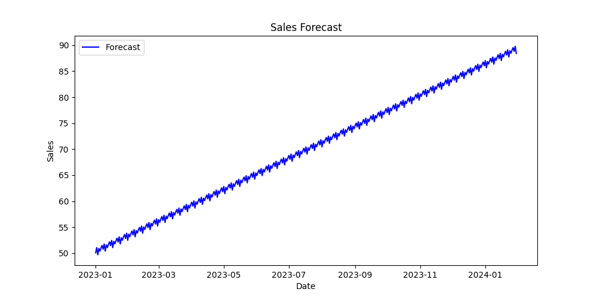
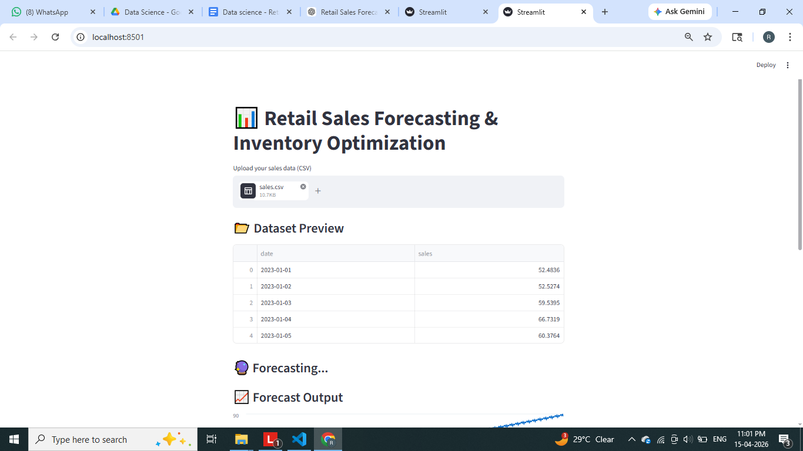
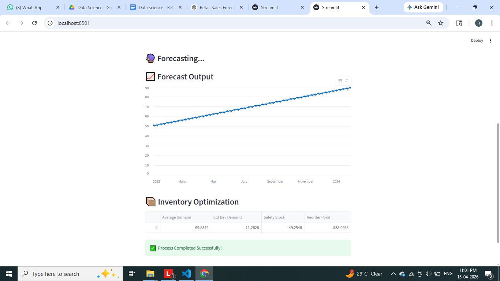
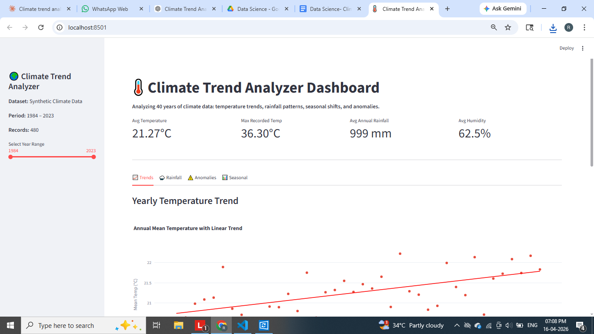

# 🛍️ Retail Sales Forecasting & Inventory Optimization System

## 📌 Overview

This project predicts future retail sales and optimizes inventory levels using machine learning and business logic.

It helps businesses avoid:

* ❌ Overstock
* ❌ Stockouts
* ✅ Improve profitability

---

## 🚀 Features

* 📊 Sales Forecasting using Prophet
* 📦 Inventory Optimization
* 🔁 Reorder Point Calculation
* 📈 Data Visualization
* 🖥️ Interactive Streamlit Dashboard

---

## 🧠 Tech Stack

* Python
* Pandas, NumPy
* Prophet (Time Series Forecasting)
* Matplotlib
* Streamlit

---

## 📂 Project Structure

```
Retail-Sales-Forecasting/
│
├── data/
├── src/
├── app/
├── outputs/
├── images/
├── main.py
├── requirements.txt
└── README.md
```

---

## ⚙️ Installation

```bash
pip install -r requirements.txt
```

---

## ▶️ Run Project

### Run backend

```bash
python main.py
```

### Run frontend

```bash
streamlit run app/app.py
```

---

## 📊 Results

### 🔹 Forecast Graph



### 🔹 UI Outputs




---

## 💼 Business Value

* Helps in demand planning
* Reduces inventory cost
* Prevents stockouts
* Improves decision-making

---

## 🔮 Future Improvements

* Multi-product forecasting
* Real-time dashboard
* AI-based demand prediction

---

## 👩‍💻 Author

Rakshitha A S
